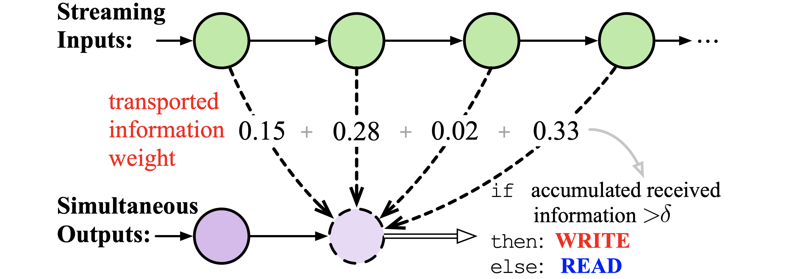

# Information-Transport-based Policy for Simultaneous Translation

Source code for our EMNLP 2022 main conference paper "Information-Transport-based Policy for Simultaneous Translation" (PDF)



Our method is implemented based on the open-source toolkit [Fairseq](https://github.com/pytorch/fairseq).

## Requirements and Installation

- Python version = 3.8

- [PyTorch](http://pytorch.org/) version = 1.7.1

- Install requirements:

  ```bash
  git clone https://github.com/ictnlp/ITST.git
  cd ITST
  pip install -r requirements.txt
  pip install --editable ./
  ```

## Quick Start

Information-transport-based simultaneous translation (ITST) achieves good results on both **text-to-text simultaneous translation** and **speech-to-text simultaneous translation** (a.k.a., streaming speech translation). Detailed introductions refer to:

- [Text-to-text simultaneous translation](https://github.com/ictnlp/ITST/blob/main/Text-to-text%20Simultaneous%20Translation.md)
- [Speech-to-text simultaneous translation with fixed pre-decision](https://github.com/ictnlp/ITST/blob/main/Speech-to-text%20Simultaneous%20Translation%20with%20Fixed%20Pre-decision.md)
- [Speech-to-text simultaneous translation with flexible pre-decision](https://github.com/ictnlp/ITST/blob/main/Speech-to-text%20Simultaneous%20Translation%20with%20Flexible%20Pre-decision.md)

All example shell scripts refer to [shell_scripts/](shell_scripts/).

## Citation

If you have any questions, feel free to contact me with: `zhangshaolei20z@ict.ac.cn`.

In this repository is useful for you, please cite as:

```
@inproceedings{ITST,
    title = "Information-Transport-based Policy for Simultaneous Translation",
    author = "Zhang, Shaolei  and
      Feng, Yang",
    booktitle = "Proceedings of the 2022 Conference on Empirical Methods in Natural Language Processing",
    month = dec,
    year = "2022",
    address = "Online and Abu Dhabi",
    publisher = "Association for Computational Linguistics",
}
```
